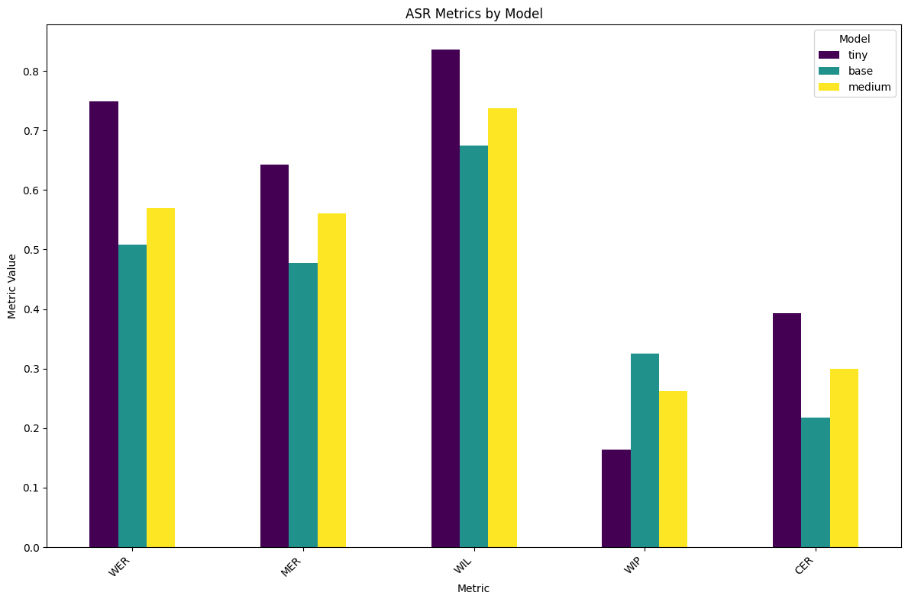

# Whisper ASR - Clinical Report Generation from Audio

## Overview

**Whisper ASR** is a proof-of-concept system that transcribes audio recordings from sonography sessions and generates structured clinical reports. This project leverages **Whisper** for audio transcription. The system is designed for the **MCDA GenAI event** at Saint Mary's University (SMU).

🔗 **Live Demo**: [Hugging Face Spaces - WhisperASR](https://huggingface.co/spaces/AbdiazizAden/WhisperASR)

## Problem Statement

Given an anonymized clinical audio recording (in `.wav` format), the goal is to generate a structured clinical report. The report will include information like sonography findings, patient details, and other medical data.

## Features

- **Audio Transcription**: The system uses Whisper to transcribe `.wav` audio files into text.
- **Structured Report Generation**: A report is generated based on the extracted transcription, formatted in a clinical report style.
- **Web Interface**: A simple, user-friendly interface for uploading `.wav` files and generating reports.

## Installation

### Prerequisites

Before running the application, ensure you have the following installed:

- Python 3.7+
- pip
- Virtual environment (optional but recommended)

### Setup

1. Clone the repository:

   ```bash
   git clone https://github.com/yourusername/WhisperASR.git
   cd WhisperASR
   ```

2. Create a virtual environment and activate it (optional but recommended):

   ```bash
   python3 -m venv venv
   source venv/bin/activate   # For Linux/Mac
   venv\Scripts\activate      # For Windows
   ```

3. Install dependencies:

   ```bash
   pip install -r requirements.txt
   ```

4. Download and set up the models:

   - **Whisper model** for transcription. (Please see [Whisper Documentation](https://github.com/openai/whisper) for more details)
   - Ensure the `.wav` audio files are accessible.

## Usage

### Running the Application Locally

1. Start the application:

   ```bash
   python app.py
   ```

2. A gradio interface will load in a few seconds.

3. Upload your `.wav` audio file.

4. After processing, the system will generate and display a structured clinical report.

### Files & Input

- **Input Audio**: `.wav` files for transcription.

### Example

#### Example Audio:

- `example_audio.wav` - An anonymized sonography recording.

### Output

The system will output a report similar to the structure of the provided clinical notes.

### Notes on Performance

- The **medium** Whisper model requires substantial resources and may not be available in certain environments due to limitations in the system's storage. Please use the **tiny** or **base** models for lower resource consumption.
- If you're testing on a server with storage limitations, consider using the `base` or `tiny` Whisper models.

#### ASR Metrics by Model

Below is a comparison of the ASR (Automatic Speech Recognition) metrics for the **tiny**, **base**, and **medium** Whisper models:



- **Metric**: WER (Word Error Rate)	Measures the percentage of words that are incorrectly recognized in the transcription compared to the reference text. Lower WER indicates better accuracy.
MER (Match Error Rate)	Represents the proportion of words that are incorrectly matched between the reference and transcribed text. It is another measure of transcription accuracy, where lower values are better.
WIL (Word Information Lost)	Quantifies the amount of word information lost during the transcription process. It indicates how much of the original information is missing in the transcription. Lower WIL is preferred.
WIP (Word Information Preserved)	Measures the proportion of word information from the reference text that is successfully preserved in the transcription. Higher WIP suggests better retention of original information.
CER (Character Error Rate)	Similar to WER, but calculated at the character level instead of words. It measures the percentage of characters that are incorrectly recognized in the transcription. Lower CER indicates better accuracy at the character level.

- **Models**: tiny, base, medium

The figure highlights the performance trade-offs between the models on the small set of the given audio files and their ground truth texts. The **medium** model offers the highest accuracy but requires more computational resources, while the **tiny** model is faster but less accurate. The **base** model strikes a balance between the two.

## Authors

- **Abdiaziz Muse** - [@AbdiazizAden](https://github.com/Prezzo-K)
